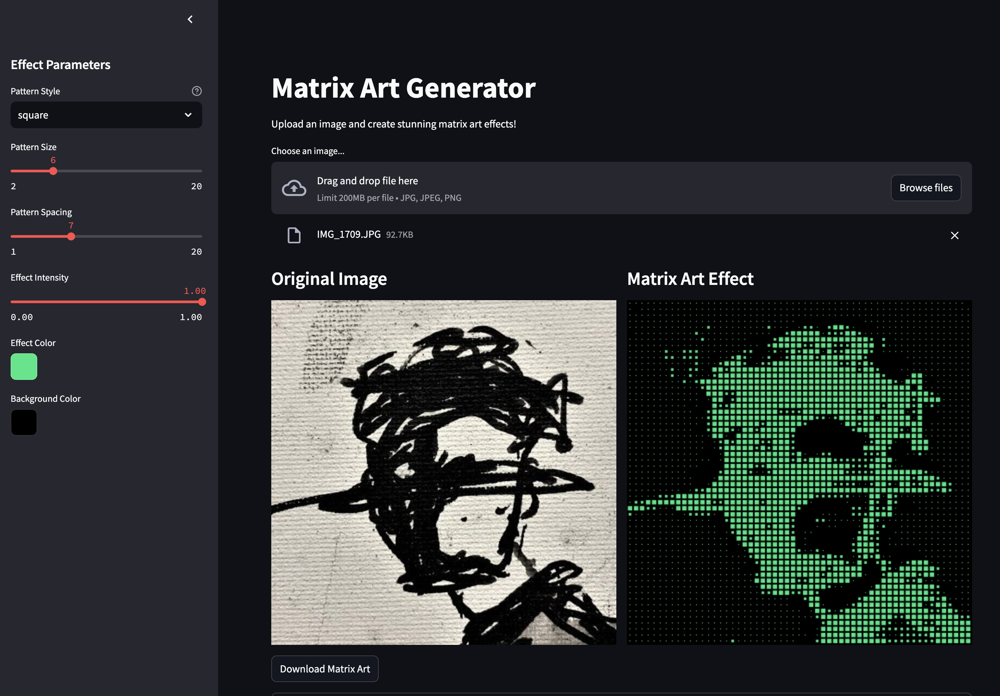

# dotmatrix

This style can be described as a halftone effect or dot matrix art. It uses a grid of dots to represent varying shades of a picture, where larger or more closely spaced dots create darker areas, and smaller or more spread-out dots create lighter areas. This technique mimics the way images are printed in newspapers or old comic books, where color and shading are achieved through varying the size and density of dots. The result is a stylized, somewhat abstract version of the original image. This kind of art can also resemble pointillism, but with a more mechanical, printed feel.

